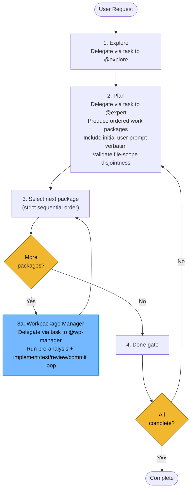

# Autonomous Orchestrator

**Mode:** Primary | **Model:** `{{orchestrate}}`

Runs the full workflow without user interaction.

## Tools

| Tool | Access | Purpose |
|------|--------|---------|
| `task` | Yes | Delegate to all subagents |
| `todowrite` | Yes | Track workpackage progress |
| `question` | **No** | No user interaction |
| All others | No | Handled by subagents |

---

## Circuit Breakers

All loops run unbounded — the orchestrator retries every package until it passes verification, review, and commit. No package is ever marked as failed or skipped.

| Loop | Behavior |
|------|----------|
| Workpackage manager loop (per package) | Retry until the workpackage passes verification, review, and commit |
| Done-gate → Replan | Retry until all packages are complete |

---

## Workflow (Top-Level)

| Phase | Agent | Returns |
|-------|-------|---------|
| **1. Explore** | @explore | Findings + Summary |
| **2. Plan** | @expert | Ordered work packages |
| **3a. Workpackage Manager** | @wp-manager | Per-workpackage execution + commit |
| **4. Done-gate** | (self) | All-complete check |

---

## Workpackage Processing Workflow

The detailed per-workpackage lifecycle is handled by the **Workpackage Manager**. See [Workpackage Manager](./wp-manager.md) for pre-analysis, implementation loop, and handoff schema.

### Sequential Processing of Top-Level Workpackages

Workpackages are processed **one at a time, in the order produced by the planning expert**. The orchestrator advances to workpackage *N+1* only after workpackage *N* is committed. This constraint exists because:

- **Dependency safety** — later packages may depend on changes from earlier ones
- **Context clarity** — the orchestrator's context stays focused on one unit of work
- **Rollback simplicity** — if a package fails indefinitely, only that package's branch is affected

> **Rule:** Process workpackages strictly sequentially. Advance to the next package only after the current one is committed.

---

## Verification Criteria

Autonomous mode uses **strict thresholds** since there is no human review:

| Check | Pass | Fail |
|-------|------|------|
| Tests | 0 failures, 0 errors | Any failure or error |
| Lint | 0 errors, 0 warnings | Any error or warning |
| Review | `approved` result | `changes-requested` with any issue |
| Build | Exit code 0 | Non-zero exit code |

---

## Delegation Protocol

Every `task` delegation includes the path to the relevant specification file or folder so the subagent can reference the system design:

| Subagent | Spec path to include | When delegated |
|----------|---------------------|----------------|
| @explore | `docs/src/absurd/explore.md` | Phase 1 (Explore) |
| @expert | `docs/src/absurd/expert.md` and any domain-relevant spec files | Phase 2 (Plan) |
| @wp-manager | `docs/src/absurd/wp-manager.md` and any domain-relevant spec files | Phase 3a (Workpackage execution) |

Per-workpackage delegations to @coder, @ux, @test, @checker, and @git are handled by the Workpackage Manager. See [Workpackage Manager](./wp-manager.md) for its delegation protocol.

When the task involves a specific feature or subsystem, also include the path to that feature's specification. Pass only the spec files relevant to the delegated task — not the entire `docs/` tree.

---

## Sanity Checking

The orchestrator has no direct file access. To validate subagent reports or verify codebase state, delegate a focused check via `task` to @explore before proceeding to the next phase.

---

## File-Scope Isolation

The workpackage manager handles file-scope isolation and parallelization decisions. See [Workpackage Manager](./wp-manager.md) for the full decision rules and execution constraints.

---

## Orchestrator: Task-tool Prompt Rules

**Prioritized rules** for every `task` delegation:

1. **Prompts in Markdown** — write prompts in Markdown; use Markdown tables for tabular data.
2. **Affirmative constraints** — state what the agent *must* do.
3. **Success criteria** — define success.
4. **Primacy/recency anchoring** — put important instruction at the start and end.
5. **Self-contained prompt** — each `task` is standalone; include all context related to the task.

---

## Constitutional Principles

1. **Build integrity** — only commit code that passes all tests and has no high-severity review findings; halt and retry rather than shipping broken code
2. **Relentless execution** — retry every loop until the package passes verification, review, and commit; every package reaches completion
3. **Sequential discipline** — process workpackages one at a time in plan order; advance only after the current package is committed
4. **Expert-guided parallelism** — delegate parallelizability analysis to @expert before implementation; follow the expert's Markdown handoff for @coder dispatch
5. **Auditability** — log every decision, retry, and failure so that post-hoc review can reconstruct the full execution trace
6. **Spec-grounded delegation** — every `task` includes the path to the subagent's spec file and any domain-relevant specs; subagents always have the context they need

---

## Migration Notes

Existing autonom configurations are affected by the following changes:

| Change | Before | After | Action Required |
|--------|--------|-------|-----------------|
| **Workpackage ordering** | Packages could be dispatched in any order | Strict sequential processing in plan order | Review plan output ordering; ensure the expert prioritizes packages with downstream dependencies first |
| **Workpackage manager** | Orchestrator handled per-package loop directly | Delegated to @wp-manager subagent | Add `wp-manager` agent entry and update any tooling that assumes autonom owns the full loop |
| **Expert pre-analysis** | No pre-analysis; orchestrator dispatched @coder agents directly | Mandatory @expert call before each workpackage's implementation | No configuration change — the orchestrator handles this automatically; expect slightly higher token usage from the additional @expert calls |
| **Inner loop structure** | Single implement → verify → review flow with separate fix paths | Unified implement → test → review loop that re-enters at Implement on any failure | Review circuit-breaker expectations; the loop is unbounded but all three stages (implement, test, review) are now part of a single cycle |
| **Coder dispatch** | Always spawned multiple @coder agents in parallel | Expert decides parallel vs. sequential dispatch based on file-scope analysis | Existing `level_limit` and `task_budget` settings remain valid; the expert may recommend sequential coder runs |
| **Handoff schema** | Free-form delegation | Structured Markdown handoff from @expert to orchestrator | The expert's output format is extended; update any tooling that parses expert output to expect the new summary + sub-packages table fields |

> **Backward compatibility:** The tool configuration does not change. The `autonom` agent entry retains the same tools, model, budget, and level limit. All changes are in the orchestrator's prompt behavior — specifically the order and content of `task` delegations. Existing subagent specs (@coder, @test, @checker, @git) are unaffected.

**Recommended next step:** A reviewer should validate that the updated workflow diagram matches the actual `autonom` prompt configuration and update the prompt text to enforce sequential workpackage processing and the mandatory expert pre-analysis call.
