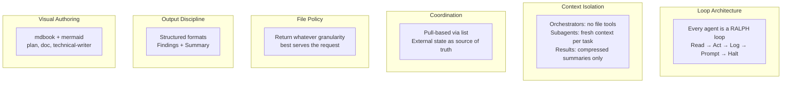
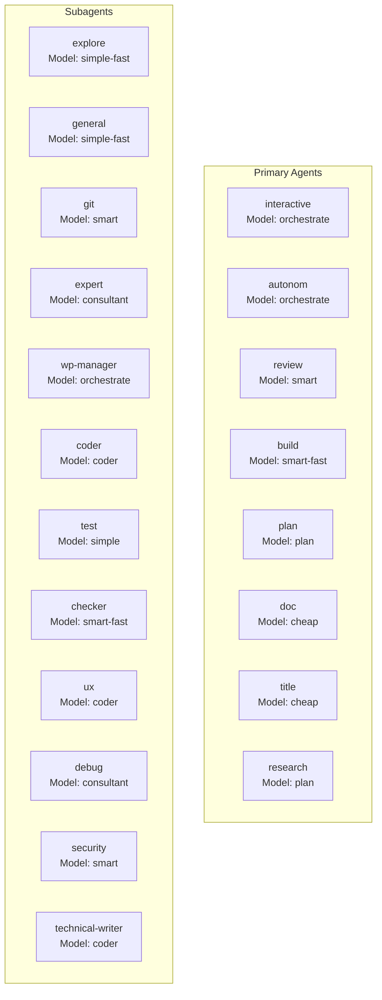
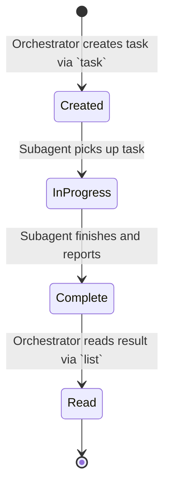
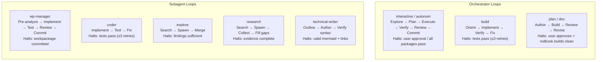
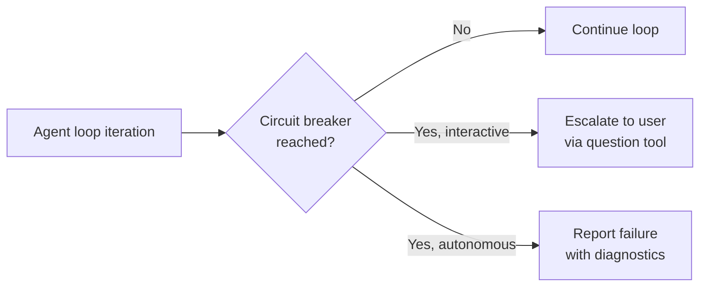
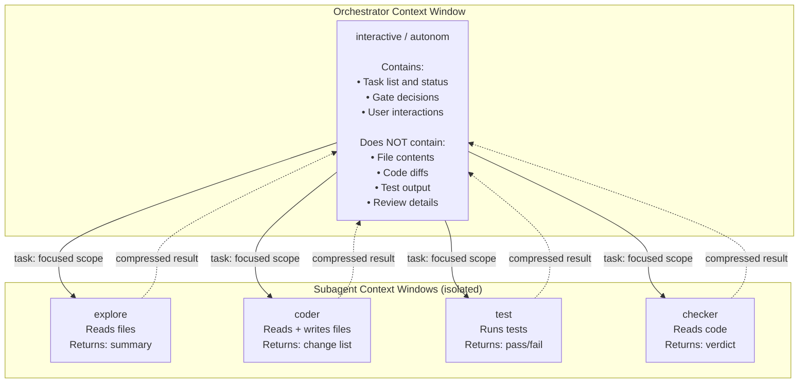
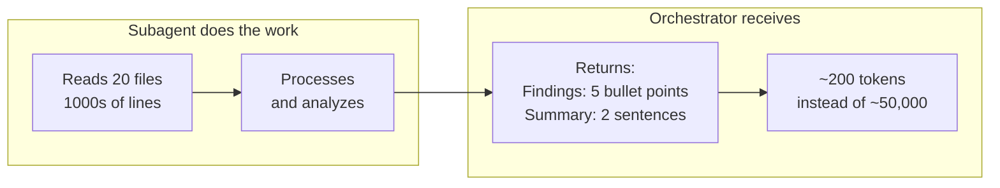
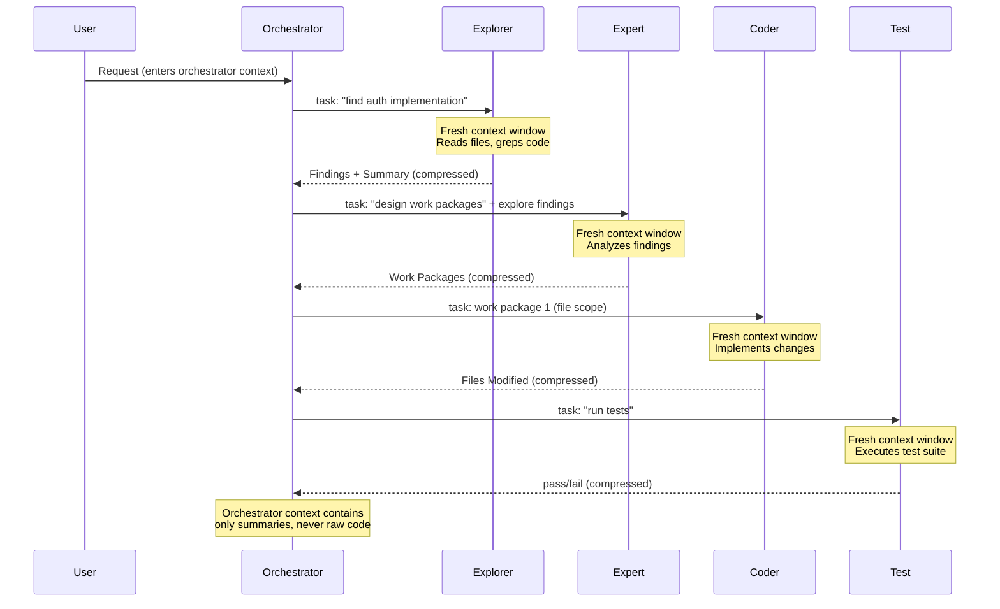

# Absurd Configuration Overview

**File:** `absurd.json`

The absurd configuration is a streamlined variant that replaces `todoread`/`todowrite` with `list`-based context, relaxes file-return policies, and enhances the plan agent with visual mdbook + mermaid output. Its architecture is built on two foundational principles: **every workflow is a loop** and **context is managed through subagent isolation**.

## Global Settings

| Setting | Value |
|---------|-------|
| `$schema` | `https://opencode.ai/config.json` |
| `default_agent` | `plan` |
| **Permissions** | `todowrite: allow`, `todoread: allow` |

## Design Principles

## Agent Roster

## Model Tier Table

Template variables map to capability tiers, not specific model names (which change over time).

| Variable | Tier | Capability Profile | Used By |
|----------|------|-------------------|---------|
| `{{orchestrate}}` | High | Long-context reasoning, workflow management, multi-step planning | interactive, autonom, wp-manager |
| `{{consultant}}` | High | Deep architectural analysis, complex investigation, expert judgment | expert, debug |
| `{{smart}}` | High | Careful analysis, nuanced decisions, comprehensive review | git, review, security |
| `{{smart-fast}}` | Mid-High | Fast analysis with good judgment, quick reviews | build, checker |
| `{{coder}}` | Mid-High | Code generation, implementation, technical fluency | coder, ux, technical-writer |
| `{{plan}}` | High | Structured planning, document generation, visual output | plan |
| `{{simple}}` | Mid | Reliable execution of well-defined tasks, structured reporting | test |
| `{{simple-fast}}` | Mid | Fast execution of focused tasks, discovery, minor edits | explore, general |
| `{{cheap}}` | Low | Minimal tasks requiring no reasoning (titles, labels, orchestration) | title, doc |

## Tool Access Matrix

| Agent | task | read | write | edit | bash | glob | grep | web | todo |
|-------|------|------|-------|------|------|------|------|-----|------|
| interactive | Y | - | - | - | - | - | - | - | Y* |
| autonom | Y | - | - | - | - | - | - | - | Y* |
| wp-manager | Y | - | - | - | - | - | - | - | Y* |
| explore | Y | Y | - | - | - | - | Y | Y | - |
| general | Y | Y | Y | Y | Y | Y | Y | Y | - |
| git | Y | Y | - | - | Y | Y | Y | - | - |
| expert | Y | Y | - | - | Y | Y | Y | Y | - |
| coder | Y | Y | Y | Y | Y | Y | Y | Y | - |
| test | - | Y | - | - | Y | Y | Y | - | - |
| checker | - | Y | - | - | Y | Y | Y | - | - |
| ux | - | Y | Y | Y | Y | Y | Y | Y | - |
| research | Y | Y | - | - | - | Y | Y | Y | Y* |
| review | Y | Y | - | - | - | Y | Y | Y | Y* |
| build | Y | Y | Y | Y | Y | Y | Y | Y | Y* |
| plan | Y | Y | Y | Y | Y | Y | Y | Y | Y* |
| debug | Y | Y | - | - | Y | Y | Y | Y | - |
| security | - | Y | - | - | Y | Y | Y | Y | - |
| doc | Y | - | - | - | Y | - | - | - | Y* |
| technical-writer | Y | Y | Y | Y | - | Y | Y | Y | - |
| title | - | - | - | - | - | - | - | - | - |

*\* `todowrite` only (no `todoread` — uses `list` instead)*

## Coordination Model

### Task Lifecycle

Agents coordinate via the `task` and `list` tools following a pull-based model:

1. **Create** — The orchestrator (or parent agent) creates a task using the `task` tool, providing the work package and expected output format
2. **Execute** — The subagent receives the task, performs work using its scoped tools, and produces a structured result
3. **Complete** — The subagent writes its result in the defined output format
4. **Poll** — The orchestrator uses `list` to check task status. This is a **pull-based** model — the orchestrator polls for completion, subagents do not push notifications

### `todowrite` vs `list`

- `todowrite` is used by orchestrators and primary agents to maintain a persistent checklist of high-level progress (work packages completed, gates passed, failures logged)
- `list` is used to view the current state of delegated tasks and their results
- Subagents do **not** have `todowrite` access — they report results through their task output format only

### Delegation Protocol

When delegating via the `task` tool, include:
- The specific work package (not full task history)
- Expected output format
- File scope (for coder agents)
- Success criteria (for verification agents)

## Verification Criteria

Orchestrators interpret @test and @checker results (received via `task` delegation) using explicit thresholds:

### Interactive Mode

| Check | Pass | Fail |
|-------|------|------|
| Tests | 0 failures, 0 errors | Any failure or error |
| Lint | 0 errors (warnings acceptable) | Any error |
| Review | `approved` result | `changes-requested` with any `high` severity |
| Build | Exit code 0 | Non-zero exit code |

### Autonomous Mode (Stricter)

| Check | Pass | Fail |
|-------|------|------|
| Tests | 0 failures, 0 errors | Any failure or error |
| Lint | 0 errors, 0 warnings | Any error or warning |
| Review | `approved` result | `changes-requested` with any issue |
| Build | Exit code 0 | Non-zero exit code |

## Use Case Guide

| Scenario | Recommended Entry Point |
|----------|------------------------|
| Complex multi-file feature with user oversight | `interactive` |
| CI/CD pipeline, automated batch processing | `autonom` |
| Single-shot bug fix, quick implementation | `build` |
| Comprehensive code audit | `review` |
| Codebase questions, architecture understanding, information retrieval | `research` |
| Design document, project planning | `plan` |
| Software/system documentation, mdbook generation | `doc` |

## The Loop Principle: Everything Is a RALPH Loop

The [Ralph Loop](https://dev.to/alexandergekov/2026-the-year-of-the-ralph-loop-agent-1gkj) — **Read, Act, Log, Prompt, Halt** — is a [continuous iteration paradigm](https://www.alibabacloud.com/blog/from-react-to-ralph-loop-a-continuous-iteration-paradigm-for-ai-agents_602799) where an agent repeats a cycle until verifiable completion criteria are met. Unlike single-shot generation or ReAct-style internal reasoning, the RALPH loop externalizes control: an outer structure decides whether the agent is done, not the agent itself.

Every agent in the absurd configuration implements this pattern, whether explicitly or structurally:

### How Each Agent Embodies the Loop

| Agent | **Read** (observe state) | **Act** (perform work) | **Log** (record result) | **Prompt** (check completion) | **Halt** (exit condition) |
|-------|--------------------------|------------------------|------------------------|------------------------------|--------------------------|
| **interactive** | `list` to poll subagent status | Delegate via `task` | `todowrite` progress | `question` to user | User confirms at each gate |
| **autonom** | `list` to poll subagent status | Delegate via `task` | `todowrite` progress | Check all packages | All packages pass verification |
| **wp-manager** | `list` to poll subagent status | Delegate via `task` | `todowrite` progress | Check workpackage gates | Workpackage committed |
| **build** | `read`, `grep` for orientation | `write`, `edit`, `bash` | Structured output format | Run tests and linters | Exit code 0, 0 failures |
| **coder** | `read` file scope | `write`, `edit`, `bash` | Report modified files | Delegate to `@test` | Tests pass (≤3 retries) |
| **explore** | `read`, `grep` for discovery | Spawn sub-explorers | Findings + Summary | Evaluate coverage | Findings answer the question |
| **research** | `read`, `grep`, web search | Spawn recursive `@research` | Structured report | Check evidence gaps | No gaps remain |
| **plan** | Explore findings via `@explore` | Author mdbook pages | `mdbook build` | `question` to user | User approves plan |
| **doc** | Explore findings via `@explore` | Delegate to `@technical-writer` | `todowrite` progress | `mdbook build` + `question` | User approves documentation |
| **technical-writer** | `read` source, explore findings | `write` mdbook pages | Page path + summary | Re-read, check mermaid syntax | Valid page with diagrams |
| **expert** | Delegate to `@explore` | Synthesize analysis | Analysis + Work Packages | Evaluate completeness | Grounded recommendation produced |
| **checker** | `read` code under review | Analyze against criteria | Structured review verdict | Check severity thresholds | Verdict delivered |

### Circuit Breakers Prevent Infinite Loops

The RALPH pattern requires a halt condition — without one, agents loop forever. The absurd configuration enforces this through **circuit breakers**:

| Circuit Breaker | Limit | Applies To |
|-----------------|-------|------------|
| Verify → Fix | 3 retries | build, coder |
| Review → Fix | 2 retries | interactive |
| Done-gate → Replan | 2 retries | interactive |
| User feedback rounds | 2 rounds | interactive, plan, doc |
| Writer rework | 2 retries | doc |
| Build fix | 3 retries | doc, plan |
| Autonomous loops | **Unbounded** | autonom (retries until pass) |

## Context Management Architecture

The absurd configuration implements all four strategies of [context engineering](https://rlancemartin.github.io/2025/06/23/context_engineering/) identified in modern agentic systems research:

### Strategy 1: Context Isolation (Subagent Boundaries)

The most powerful context management technique in the absurd configuration is **structural isolation**. [Each subagent operates with its own context window](https://www.richsnapp.com/article/2025/10-05-context-management-with-subagents-in-claude-code), receiving only the information relevant to its task.

> **Key design decision:** The interactive and autonom orchestrators have **no file tools at all**. They cannot `read`, `write`, `edit`, `grep`, or `glob`. This is not a limitation — it is the primary context management mechanism. By forcing all file interaction through subagent delegation, the orchestrator's context window stays clean and focused on workflow coordination.

### Strategy 2: Context Offloading (External State)

Progress and decisions are written to external systems rather than held in the context window:

| Mechanism | What It Stores | Used By |
|-----------|---------------|---------|
| `todowrite` | High-level progress (packages completed, gates passed) | Orchestrators, plan, doc, build |
| Git commits | Code state across iterations | All agents that modify code |
| mdbook files | Documentation state | plan, doc, technical-writer |
| Structured output | Task results in defined formats | All subagents |

### Strategy 3: Context Compression (Structured Output)

Every subagent has a defined **output format** that compresses work into a minimal summary. The orchestrator never sees the raw data — only the compressed result:

| Agent | Raw Context Cost | Compressed Output |
|-------|-----------------|-------------------|
| explore | Entire file contents, grep results | Findings + Summary (excerpts + line refs) |
| coder | All file reads, edits, test runs | Completed + Files Modified + Notes |
| test | Full test suite output | N passed, M failed, K skipped |
| checker | Full code review analysis | Severity + Location + Verdict |
| expert | Multi-file architectural analysis | Analysis + Work Packages + Recommendation |

### Strategy 4: Context Retrieval (Pull-Based Coordination)

Rather than pushing all information into the context upfront, agents **pull context on demand** using targeted tools:

| Pull Mechanism | What It Retrieves | When Used |
|---------------|-------------------|-----------|
| `list` | Current task status and results | Orchestrators polling for completion |
| `read` | Specific file contents | Subagents needing targeted context |
| `grep` | Pattern matches across codebase | Explorers and researchers finding relevant code |
| `task` to `@explore` | Focused codebase research | Any agent needing to understand code without reading it all |

### How Context Flows Through the System

### Context Isolation in Practice

The tool access matrix enforces isolation structurally — it is not a suggestion but a hard constraint:

| Agent Type | File Read | File Write | Why |
|-----------|-----------|------------|-----|
| **Orchestrators** (interactive, autonom) | No | No | Prevents context pollution from code |
| **Doc orchestrator** (doc) | No | No | Coordinates writers, never reads/writes pages |
| **Researchers** (explore, research, expert) | Yes | No | Can observe but not mutate |
| **Implementers** (coder, ux, technical-writer) | Yes | Yes | Need full file access for their work |
| **Verifiers** (test, checker, security) | Yes | No | Read-only ensures they cannot "fix" what they review |
