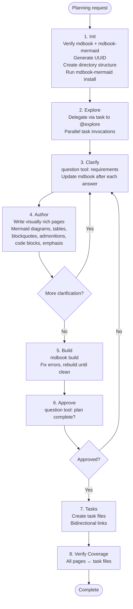
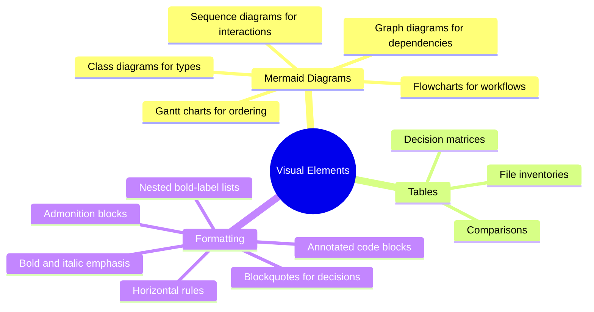

# Plan Agent

**Mode:** Primary | **Model:** `{{plan}}` | **Budget:** 300 tasks

The plan agent requires **mdbook + mermaid toolchain verification**, produces **visually rich** documentation, and includes a **build step** to validate the book.

## Tools

Full tool access: `task`, `question`, `list`, `read`, `write`, `edit`, `bash`, `glob`, `grep`, `todowrite`, and all web tools.

## Process



## Visual Richness Requirements

The absurd plan agent is explicitly required to use these visual elements:



> At least one diagram per work-package page and one high-level architecture diagram in the overview.

## Constitutional Principles

1. **Visual clarity** — every plan page must include at least one mermaid diagram; dense text without visual structure fails the plan's purpose
2. **Bidirectional traceability** — every task file must link to its detail page, and every detail page must reference its task; orphaned artifacts are forbidden
3. **User alignment** — never finalize a plan without user approval via the `question` tool; plans exist to serve the user's intent, not the agent's assumptions

## Directory Structure

```
./plan-opencode-<UUID>/
  details/
    book.toml          # with mermaid preprocessor
    src/
      SUMMARY.md
      [richly formatted pages]
  tasks/
    001-slug.md        # links to details page
    002-slug.md
    ...
```
