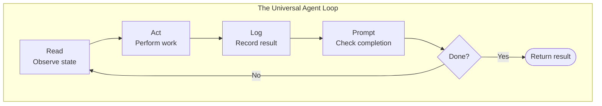
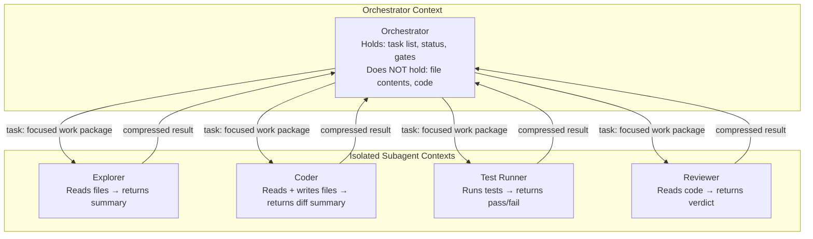

# OpenCode Agent Configuration

This book documents the Absurd OpenCode multi-agent configuration and the prompt engineering principles behind it. The architecture is grounded in two key ideas from modern agentic coding: **context management through subagent isolation** and the principle that **every agent workflow is a loop**.

## Configuration

| Configuration | File | Philosophy |
|---------------|------|------------|
| **Absurd** | `absurd.json` | Streamlined orchestration with `list`-based context, relaxed file-return policies, and visual mdbook planning |

## Core Principles

### Everything Is a Loop

Every agent in this system — from orchestrators to leaf subagents — operates as a loop. This mirrors the [Ralph Loop](https://dev.to/alexandergekov/2026-the-year-of-the-ralph-loop-agent-1gkj) paradigm that has emerged as a foundational pattern for autonomous AI agents: run a cycle, check the result, and either proceed or iterate.

The Ralph Loop — **Read, Act, Log, Prompt, Halt** — captures the essence of all agentic workflows. Rather than relying on a single-shot generation, agents iterate until verifiable completion criteria are met. Progress lives in *external state* (files, git history, test results), not in the LLM's context window.

This pattern appears at every level of the absurd configuration:

| Agent | Loop Pattern | Halt Condition |
|-------|-------------|----------------|
| **interactive** | Explore → Plan → Execute → Verify → Review → Commit | User approval at each gate |
| **autonom** | Same cycle, unbounded retries | All packages pass verification |
| **build** | Orient → Implement → Verify → Fix | Tests pass (max 3 retries) |
| **coder** | Implement → Test → Fix | Tests pass (max 3 retries) |
| **explore** | Search → Spawn sub-explorers → Merge | Findings sufficient |
| **research** | Search → Spawn → Collect → Fill gaps | Evidence complete |
| **plan / doc** | Author → Build → Review → Revise | User approves, mdbook builds clean |

> The bowling ball metaphor: a context window filled with failed attempts is like a bowling ball in the gutter — it cannot course-correct. The loop pattern escapes this by externalizing state and, when necessary, rotating to a fresh context.

### Context Management Through Subagents

The second foundational principle is **context isolation**. Each subagent operates with its own context window, receiving only the information relevant to its task. This is the multi-agent equivalent of the `malloc/free` problem identified in [context engineering research](https://rlancemartin.github.io/2025/06/23/context_engineering/) — reading files and outputs consumes context like `malloc()`, but there is no `free()`. Subagent isolation provides that `free()`.

The four strategies of [context engineering](https://rlancemartin.github.io/2025/06/23/context_engineering/) map directly to the absurd architecture:

| Strategy | How It Appears |
|----------|---------------|
| **Offload** (write context externally) | `todowrite` for orchestrator progress; git commits as persistent state; guardrails files |
| **Retrieve** (pull context when needed) | `list` tool for polling task results; `read`/`grep` for targeted file access |
| **Compress** (reduce tokens) | Structured output formats (Findings + Summary); subagents return summaries, not raw data |
| **Isolate** (separate contexts) | Every `task` delegation creates a fresh context window; orchestrators never see file contents directly |

### Why This Matters

Without these patterns, agentic coding systems hit a wall: context pollution degrades model performance, failed attempts accumulate, and the agent becomes "stuck in the gutter." The absurd configuration addresses this structurally:

- **Orchestrators are context-blind by design** — interactive and autonom have *no file tools*. They can only delegate and observe results. This prevents context pollution from code, diffs, and test output.
- **Subagents are disposable** — each subagent task gets a fresh context. A failed coder attempt does not poison the next attempt.
- **Loops have circuit breakers** — bounded retries (3 for verify, 2 for review) prevent infinite loops while still allowing iteration.
- **External state is the source of truth** — files, git history, and test results persist across context rotations. The agent reads current state, not remembered state.

## Agent Architecture

```mermaid
graph TD
    subgraph "Primary Agents (User-Facing)"
        INT[Interactive Orchestrator]
        AUT[Autonomous Orchestrator]
        REV[Review Reporter]
        RSH[Research Reporter]
        BLD[Build Agent]
        PLN[Plan Agent]
        DOC[Doc Orchestrator]
        TTL[Title Generator]
    end

    subgraph "Subagents (Delegated)"
        EXP[Explorer]
        GEN[General Purpose]
        GIT[Git Specialist]
        XPT[Expert Analyst]
        COD[Coder]
        TST[Test Runner]
        CHK[Code Reviewer]
        UXD[UX Designer]
        DBG[Debug]
        SEC[Security Reviewer]
        TWR[Technical Writer]
    end

    INT -->|delegates| EXP
    INT -->|delegates| XPT
    INT -->|delegates| COD
    INT -->|delegates| TST
    INT -->|delegates| CHK
    INT -->|delegates| GIT
    INT -->|delegates| UXD

    AUT -->|delegates| EXP
    AUT -->|delegates| XPT
    AUT -->|delegates| COD
    AUT -->|delegates| TST
    AUT -->|delegates| CHK
    AUT -->|delegates| GIT
    AUT -->|delegates| UXD
    AUT -->|delegates| DBG
    AUT -->|delegates| SEC

    INT -->|delegates| DBG
    INT -->|delegates| SEC

    BLD -->|delegates| EXP
    BLD -->|delegates| GIT

    PLN -->|delegates| EXP
    DOC -->|delegates| EXP
    DOC -->|delegates| TWR
    TWR -->|delegates| EXP
    XPT -->|delegates| EXP
    REV -->|delegates| EXP
    RSH -->|self-recursive| RSH
```

