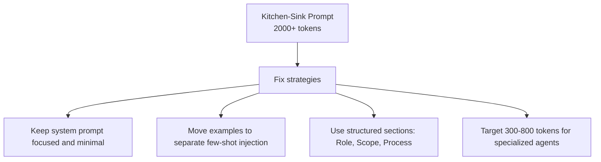
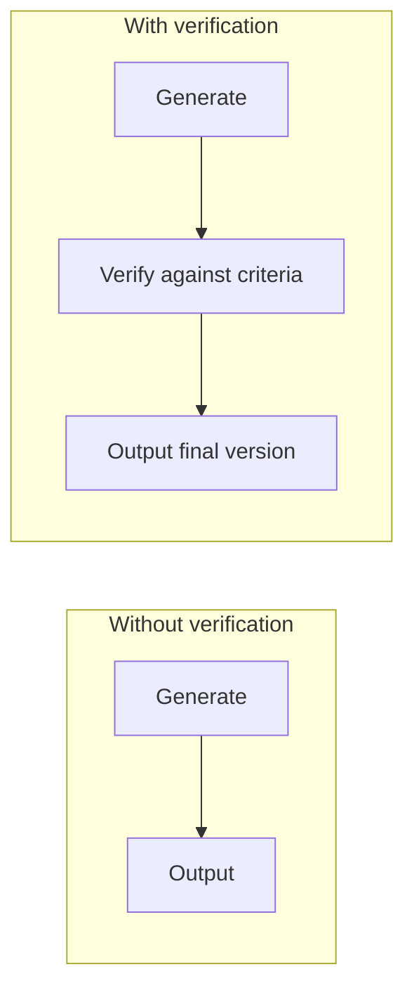

# Anti-Patterns to Eliminate

Common prompt engineering mistakes and their fixes.

---

## ALL CAPS Shouting

```
YOU MUST NEVER SKIP ANY PHASE
ABSOLUTELY FORBIDDEN
CRITICAL RULES: ...
```

**Problem:** No special token salience. Wasted effort.
**Fix:** Use structural placement (start/end, separate section).

---

## Long Lists of "NEVER" / "DO NOT"

```
- Don't do A
- Don't do B
- Don't do C
- Never do D
[...10 more...]
```

**Problem:** Negation activates concepts. Creates a constraint satisfaction puzzle.
**Fix:** Replace with 3-5 constitutional principles + affirmative alternatives.

---

## Kitchen-Sink Prompts (2000+ tokens)

**Problem:** Lost-in-the-middle effect. Critical information gets diluted.



---

## Politeness Padding

```
"Please kindly consider writing some code that might help with..."
```

**Problem:** Wasted tokens. Models are already helpful.
**Fix:** Be direct: "Write code that implements X."

---

## Ambiguous Scope

```
"Help the user with their request"
```

**Problem:** Agent doesn't know boundaries.
**Fix:** "Handle requests in [domain]. Redirect [out-of-scope] to [handler]."

---

## Implicit Tool Restrictions

```
prompt: "You should only use specific tools..."
```

**Problem:** Vague. Agent guesses wrong.
**Fix:** Explicit tool config + "Your only tools: [X, Y, Z]."

---

## No Verification Step

**Problem:** Agent generates without checking.



**Fix:** Include a self-check step in every process.

---

## Quick Checklist

- [ ] Does every agent have explicit **Role** + **Scope**?
- [ ] Are all constraints **affirmative** (what to do, not what to avoid)?
- [ ] Are critical constraints at **both start and end** of prompt?
- [ ] Is there a **Process** section with structure?
- [ ] Is **output format** specified?
- [ ] Are redundancies eliminated?
- [ ] Is the prompt **focused** (300-800 tokens for specialists)?
- [ ] Are tool restrictions **explicit**?
- [ ] Is there a **verification step**?
- [ ] Is the **instruction hierarchy** explicit?
