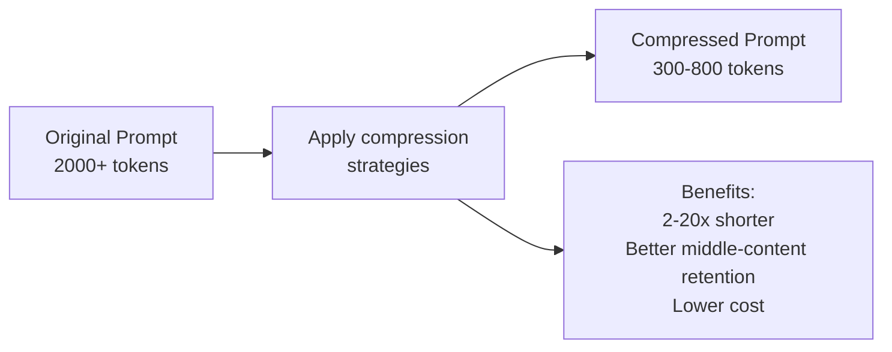
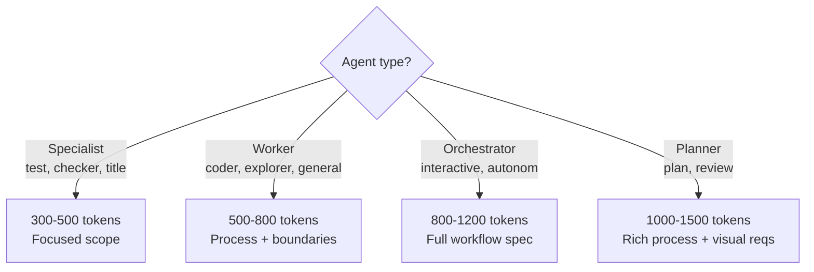

# Compression and Token Efficiency

Strategies for reducing prompt length without sacrificing effectiveness, based on LLMLingua research (Jiang et al., 2023).

---

## Strategy 1: Remove Hedge Language

| Before | After |
|--------|-------|
| "You should probably try to consider maybe writing..." | "Write..." |
| "It might be helpful if you could perhaps..." | "Do X." |
| "Please kindly consider..." | "X." |

---

## Strategy 2: Use Tables for Rules

**Before (prose):**
```
You can use read tool for reading files, write tool for creating files,
edit tool for modifying files, and bash tool for running commands.
```

**After (table):**

| Tool | Use |
|------|-----|
| read | Read files |
| write | Create files |
| edit | Modify files |
| bash | Run commands |

---

## Strategy 3: Abbreviations with Definitions

Define a format once, then reference it:

```
Agent Response Format (ARF):
{reasoning, answer, confidence}

Respond in ARF.
```

---

## Strategy 4: Implicit Structure

**Before (verbose prose):**
```
First, you should analyze the requirements. After analyzing,
you should identify potential issues. Then, you should plan
your approach...
```

**After (structured list):**
```
## Process
1. Analyze requirements
2. Identify issues
3. Plan approach
```

---

## Compression Impact



## Optimal Prompt Length



Specialist agents benefit most from compression. Orchestrators need more detail for their complex workflows but should still avoid redundancy.
