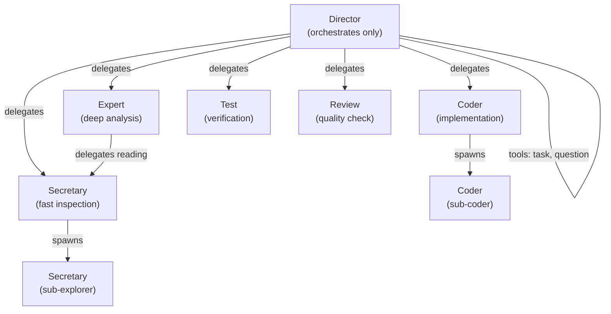
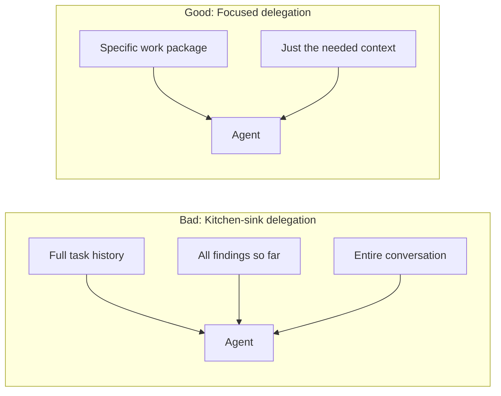
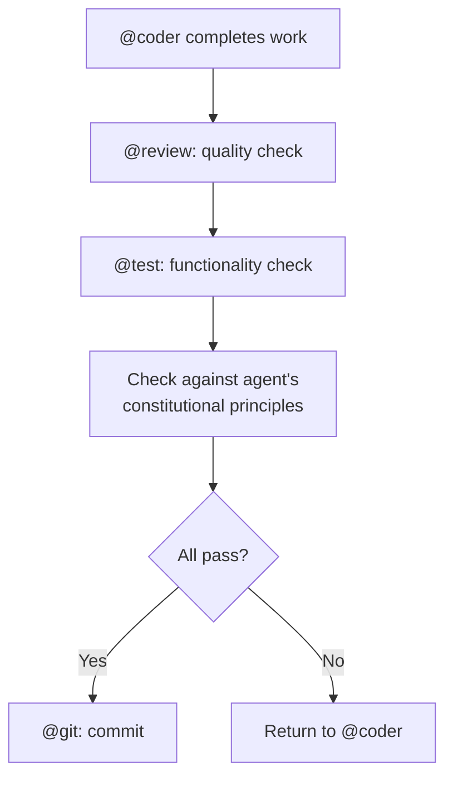

# Multi-Agent System Patterns

Patterns for designing effective multi-agent systems, drawn from Meta-Prompting and Constitutional AI research.

---

## Pattern 1: Conductor + Specialists



**Key properties:**
- Director has **no file tools** — only delegation and user interaction
- Specialists have **scoped tool access** matching their role
- Divide-and-conquer via self-spawning for parallelizable work

---

## Pattern 2: Explicit Instruction Hierarchy

```mermaid
flowchart TD
    P1["1&#46; System prompt<br/>(highest priority)"]
    P2["2&#46; Instructions from director agent"]
    P3["3&#46; User requests"]
    P4["4&#46; Tool outputs / retrieved documents<br/>(lowest priority)"]

    P1 --> P2 --> P3 --> P4

    CONFLICT["Conflicting instructions"] --> RULE["Follow highest-priority source"]
```



This prevents prompt injection from tool outputs or retrieved documents from overriding system-level constraints.

---

## Pattern 3: Minimal Context Delegation



Sub-agents perform better with **only relevant context**, not full history. Each delegation should include precisely what that agent needs — no more, no less.

---

## Pattern 4: Structured Agent Communication

```xml
<agent_message>
  <from>director</from>
  <to>code_reviewer</to>
  <task_id>review-001</task_id>
  <instruction>Review this diff for security issues</instruction>
  <context>[relevant context only]</context>
  <expected_output>
    JSON: {severity, location, description, suggestion}
  </expected_output>
</agent_message>
```

Structured messages between agents improve accuracy by making expectations explicit.

---

## Pattern 5: Constitutional Guardian



Every implementation passes through multiple verification layers before being accepted. Each agent defines 3 domain-specific constitutional principles that are enforced structurally through the verification pipeline rather than as abstract guidelines.

**Implementation note:** Constitutional principles are embedded directly in each agent's prompt file as a `## Constitutional Principles` section with 3 numbered principles. They serve as the agent's decision-making compass when facing ambiguous situations.

---

## Agent Template

```xml
<agent_definition>
  <identity>
    Role: [specific role]
    Domain: [exact scope]
    Expertise: [key capabilities]
  </identity>

  <constitution>
    1. [Principle 1 — most important]
    2. [Principle 2]
    3. [Principle 3]
  </constitution>

  <tools>
    Available: [explicit list]
    For anything else: [explicit fallback]
  </tools>

  <process>
    1. [Step 1]
    2. [Step 2]
    3. [Step 3]
  </process>

  <output_format>
    [Exact schema: JSON, XML, or structured text]
  </output_format>

  <boundaries>
    In-scope: [what this agent handles]
    Out-of-scope: [what to redirect, where]
  </boundaries>
</agent_definition>
```

This template covers all high-impact techniques: role assignment, constitutional principles, explicit tools, structured process, output format, and clear boundaries.
