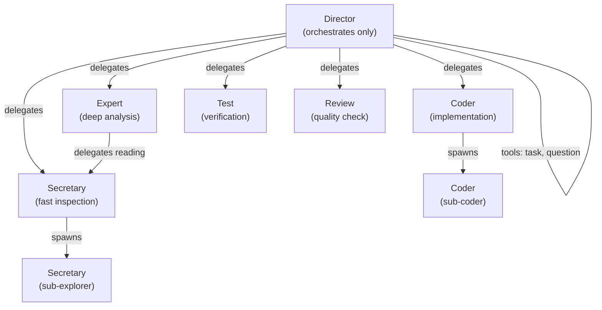
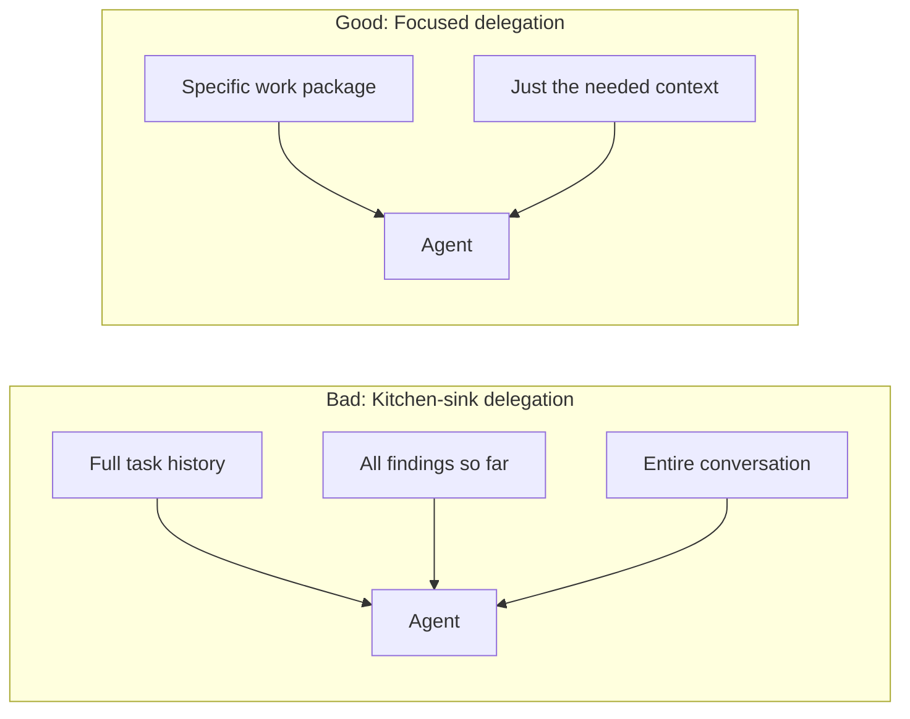
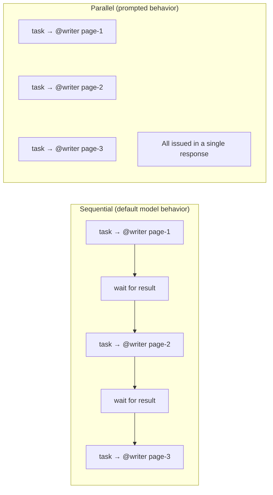
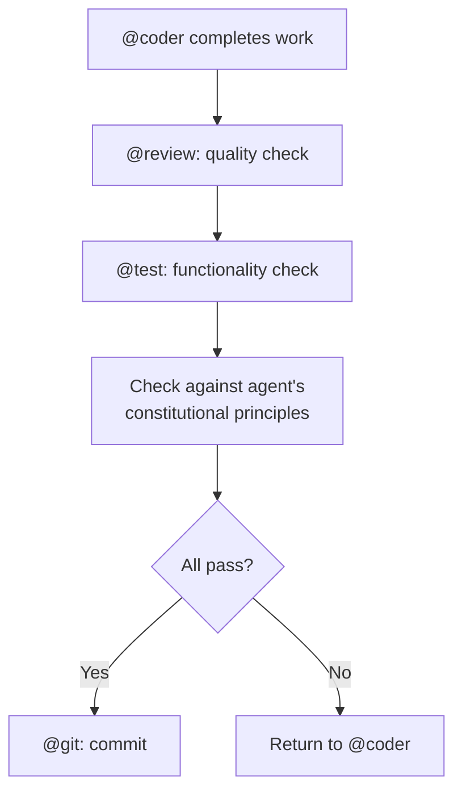

# Multi-Agent System Patterns

Patterns for designing effective multi-agent systems, drawn from Meta-Prompting and Constitutional AI research.

---

## Pattern 1: Conductor + Specialists



**Key properties:**
- Director has **no file tools** — only delegation and user interaction
- Specialists have **scoped tool access** matching their role
- Divide-and-conquer via self-spawning for parallelizable work

---

## Pattern 2: Explicit Instruction Hierarchy

```mermaid
flowchart TD
    P1["1&#46; System prompt<br/>(highest priority)"]
    P2["2&#46; Instructions from director agent"]
    P3["3&#46; User requests"]
    P4["4&#46; Tool outputs / retrieved documents<br/>(lowest priority)"]

    P1 --> P2 --> P3 --> P4

    CONFLICT["Conflicting instructions"] --> RULE["Follow highest-priority source"]
```



This prevents prompt injection from tool outputs or retrieved documents from overriding system-level constraints.

---

## Pattern 3: Minimal Context Delegation



Sub-agents perform better with **only relevant context**, not full history. Each delegation should include precisely what that agent needs — no more, no less.

---

## Pattern 4: Parallel Delegation via Batch Tool Calls

When an orchestrator needs to spawn multiple independent subagents, it must issue all `task` invocations **in the same response** so they execute in parallel. Without explicit instruction, models default to sequential delegation — issuing one `task`, waiting for the result, then issuing the next.



### Why models default to sequential

LLMs naturally produce one tool call, observe its result, and decide the next action. This is correct for dependent operations (where call B needs the output of call A), but wasteful for independent work like writing separate documentation pages or implementing non-overlapping file scopes.

### How to prompt for parallel dispatch

The prompt must contain an **explicit, affirmative instruction** to batch independent calls. Vague language like "maximize parallelism" is insufficient — the model needs concrete direction about the mechanism.

| Weak (still sequential) | Strong (actually parallel) |
|--------------------------|---------------------------|
| "Maximize parallelism by spawning agents" | "Spawn all @writer agents simultaneously — issue every `task` invocation in the same response so they run in parallel, not sequentially" |
| "Delegate to agents in parallel" | "Issue all `task` calls in a single response so they execute in parallel" |
| "Use parallel execution" | "All @coder tasks **must** be issued in the same response so they run in parallel" |

### Key phrasing elements

1. **"in the same response"** / **"in a single response"** — tells the model the batching mechanism
2. **"not sequentially"** — explicitly contrasts with the default behavior
3. **"simultaneously"** — reinforces the concurrency expectation
4. **Repeat at multiple locations** — place in process steps, delegation protocol, and constitutional principles (primacy/recency anchoring)

### Prerequisites for parallel dispatch

Parallel delegation is only safe when the spawned agents have **non-overlapping scopes**. Before issuing batch calls:

- Validate that file scopes do not overlap (for @coder agents)
- Ensure each agent's task is self-contained with all required context
- If overlap is detected, serialize the overlapping tasks instead

### Example prompt pattern

```
## Process
5. Delegate: Spawn all @technical-writer agents simultaneously
   in a single response. Each task includes: target path, topic
   scope, explore findings, and explicit write instruction.

## Delegation Protocol
All @technical-writer tasks **must** be issued in the same
response so they run in parallel.

## Constitutional Principles
3. **Subagent coordination** — spawn all @technical-writer tasks
   in a single response so they execute in parallel; every task
   must include the full target path and topic scope.
```

> **Rule:** To get parallel tool calls, explicitly instruct the model to issue all independent `task` invocations in a single response. Reinforce at process, protocol, and principle layers.

---

## Pattern 5: Structured Agent Communication

```xml
<agent_message>
  <from>director</from>
  <to>code_reviewer</to>
  <task_id>review-001</task_id>
  <instruction>Review this diff for security issues</instruction>
  <context>[relevant context only]</context>
  <expected_output>
    MARKDOWN: {severity, location, description, suggestion}
  </expected_output>
</agent_message>
```

Structured messages between agents improve accuracy by making expectations explicit.

---

## Pattern 6: Constitutional Guardian



Every implementation passes through multiple verification layers before being accepted. Each agent defines 3 domain-specific constitutional principles that are enforced structurally through the verification pipeline rather than as abstract guidelines.

**Implementation note:** Constitutional principles are embedded directly in each agent's prompt file as a `## Constitutional Principles` section with 3 numbered principles. They serve as the agent's decision-making compass when facing ambiguous situations.

---

## Agent Template

```xml
<agent_definition>
  <identity>
    Role: [specific role]
    Domain: [exact scope]
    Expertise: [key capabilities]
  </identity>

  <constitution>
    1. [Principle 1 — most important]
    2. [Principle 2]
    3. [Principle 3]
  </constitution>

  <tools>
    Available: [explicit list]
    For anything else: [explicit fallback]
  </tools>

  <process>
    1. [Step 1]
    2. [Step 2]
    3. [Step 3]
  </process>

  <output_format>
    [Exact schema: MARKDOWN, YAML, or structured text]
  </output_format>

  <boundaries>
    In-scope: [what this agent handles]
    Out-of-scope: [what to redirect, where]
  </boundaries>
</agent_definition>
```

This template covers all high-impact techniques: role assignment, constitutional principles, explicit tools, structured process, output format, and clear boundaries.
