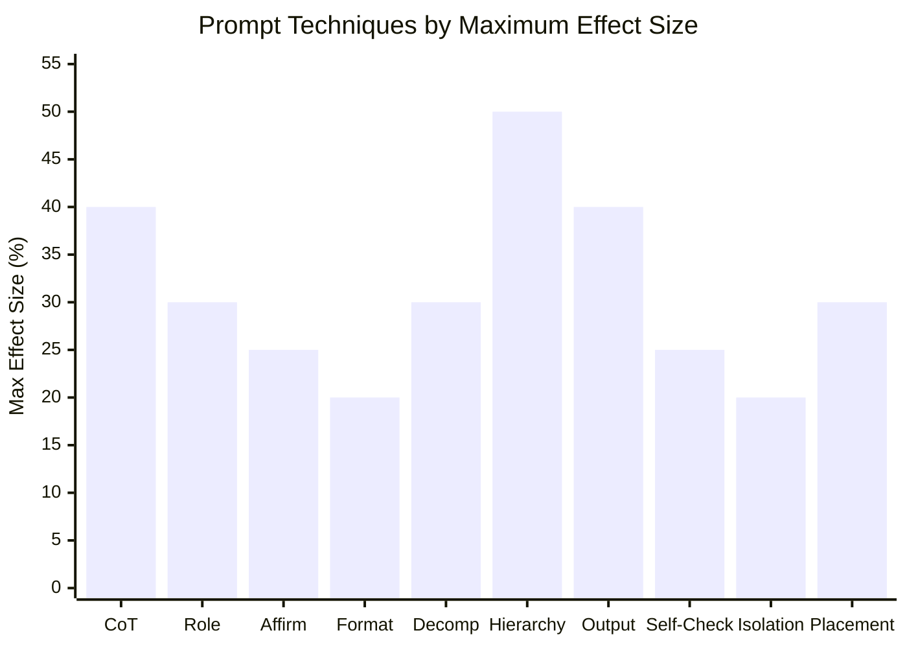

# Techniques Ranking by Impact

Evidence-backed ranking of prompt engineering techniques from peer-reviewed research (2022-2024).

## Impact Table

| Rank | Technique | Effect Size | Application |
|------|-----------|------------|-------------|
| 1 | Structured CoT with templates | +20-40% reasoning | Complex decomposition tasks |
| 2 | Role/persona (specific) | +10-30% domain tasks | Every system prompt |
| 3 | Affirmative over negative framing | +15-25% constraint adherence | All constraints |
| 4 | Structured formatting (XML/MD) | +10-20% complex tasks | Long/complex prompts |
| 5 | Decomposition (Least-to-Most, Plan-and-Solve) | +15-30% multi-step | Sequential task chains |
| 6 | Explicit instruction hierarchy | +30-50% injection robustness | Multi-agent systems |
| 7 | Output format specification | +20-40% compliance | Any structured output task |
| 8 | Self-consistency / self-verification | +10-25% accuracy | Critical decision points |
| 9 | Context isolation per agent | +10-20% multi-step accuracy | Agent delegation |
| 10 | Primacy/recency placement | +10-30% constraint adherence | Critical constraints |

## Visual Ranking

## Evidence Sources

| Finding | Source | Year |
|---------|--------|------|
| Affirmative > negative | Bsharat et al., Principled Instructions | 2024 |
| Role assignment | Schulhoff et al., Prompt Report | 2024 |
| Structured CoT | Wei et al., Chain-of-Thought | 2022 |
| Formatting (XML/MD) | Anthropic docs, Prompt Report | 2024 |
| Primacy/recency | Liu et al., Lost in Middle | 2023 |
| Instruction hierarchy | Wallace et al., OpenAI | 2024 |
| Output format spec | Multiple sources | 2023+ |
| Decomposition | Zhou et al., Wang et al. | 2023 |
| Context isolation | Suzgun & Kalai, Meta-Prompting | 2024 |
| Prompt compression | Jiang et al., LLMLingua | 2023 |

## Further Reading

- **Meta-Prompting** (Suzgun & Kalai, 2024): arXiv:2401.12954
- **The Prompt Report** (Schulhoff et al., 2024): arXiv:2406.06608
- **Principled Instructions** (Bsharat et al., 2024): arXiv:2312.16171
- **Instruction Hierarchy** (Wallace et al., 2024): arXiv:2404.13208
- **Constitutional AI** (Bai et al., 2022): arXiv:2212.08073
- **Chain-of-Thought** (Wei et al., 2022): arXiv:2201.11903
- **Lost in the Middle** (Liu et al., 2023): arXiv:2307.03172
- **LLMLingua** (Jiang et al., 2023): arXiv:2310.05736
